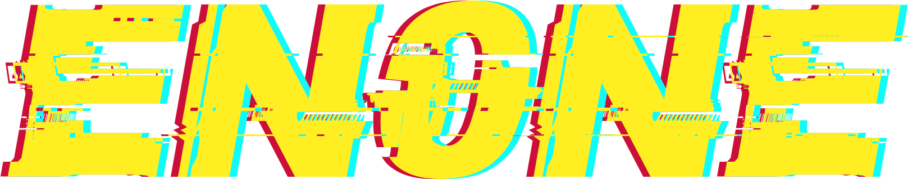

<h1 align="center">
  <br>
    
  <br>
</h1>

<h4 align="center"> <b><a href="https://github.com/YasserYka/enOne">enOne</a></b>'s sub-repository for maintaining widgets.</h4>

<p align="center">enOne is still under testing and in PRE-RELEASE phase, your feedback is much appreciated!</p>

## Development

To start writing your own widgets, run

```
$ npm run setup
```

Then answer some simple questions to generate starter package, it will create a folder with your widget name at `/output/YouWidgetName` and generate the following initial structure in it.

```
📂YourWidgetDirectory
├── 📜YourWidgetName.js
├── 📜config.json
├── 📜README.md
├── 📜package.json
```

##### *YourWidgetName.js*

```
module.exports = class YourWidgetName {
  
  // called when the module is being initialize
  async initialize(config) {

  }

  // return JSX code to generates dom to be displayed
  async render() {

    return (
        <div id="YourWidgetName"></div>
    );
  }

  // scripts to make Widget dynamic
  async script() {

  }
  
};
```

##### *config.json*

The config file can be used inside widget's index file

```
{
  "author": "YourName",
  "index": "YourWidgetName.js"
}
```

##### *README.md*

```
# YourWidgetName
Your Widget description

# Guide
How to configure
```

##### *package.json*

To install npm packages to be used inside your widgets, from the root directory please run

```
$ npm install --prefix ./output/YourWidgetDirectory/ PackageName
```

## Hot Reload

To hot reload your widget while developing, make sure your widget folder is in `/output` then run

```
$ npm start hotreload PathOfYourWidgetDirectory
```

